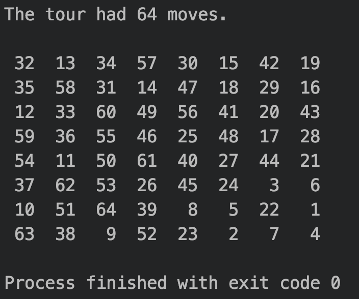
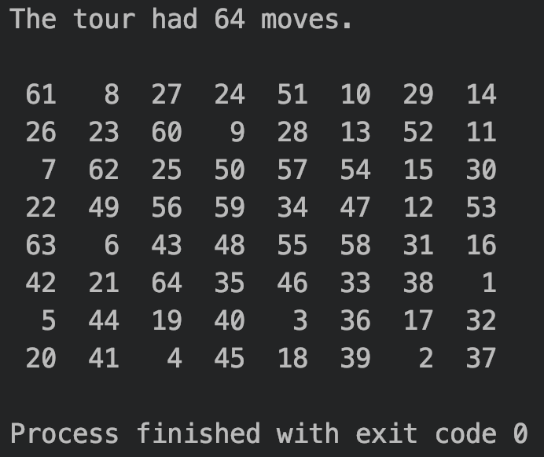

# KnightsTour
Excersise 7.22 from Deitel's Java How to Program.  
Part C uses an "accesibility heuristic" to move the knight around the board.      
.     
Part D looks ahead to the squares accesible by the tied squares and moves the knight to the square with the lowest accesibility number.  

